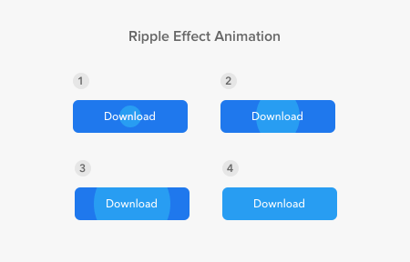

# Ripple_effect

<a href="https://codesandbox.io/s/react-button-ripple-effect-z8rqw?from-embed">#코드 샌드박스에서 작동해보기</a>
<a href="https://material-ui.com/api/button-base/#props">#UI animation</a>

직접 해석하면잔물결_효과이라는 뜻을 가집니다.

다음 애니메이션을 Ripple_effect라고 합니다.

