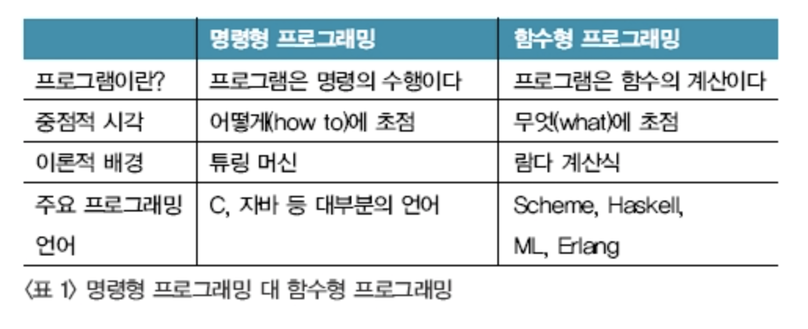

# Imperative

원형 : Imperative

의미  : 명령적인

발음 : 임퍼러티브

컴퓨터 과학에서 명령형 프로그래밍(Imperative programming)은 선언형 프로그래밍과 반대되는 개념으로, 프로그래밍의 상태와 상태를 변경시키는 구문의 관점에서 연산을 설명하는 프로그래밍 패러다임의 일종이다. 자연 언어에서의 명령법이 어떤 동작을 할 것인지를 명령으로 표현하듯이, 명령형 프로그램은 컴퓨터가 수행할 명령들을 순서대로 써 놓은 것이다.

[참고 - 위키피디아](https://ko.wikipedia.org/wiki/%EB%AA%85%EB%A0%B9%ED%98%95_%ED%94%84%EB%A1%9C%EA%B7%B8%EB%9E%98%EB%B0%8D)

## 관련 기술
1. C, Java등 대부분의 프로그래밍 언어

4. [Declarative Programming](https://github.com/MoonSupport/DICTIONARY/blob/master/D/Declarative.md) (명령형 프로그래밍)
> Imperative Programming과 반대 개념