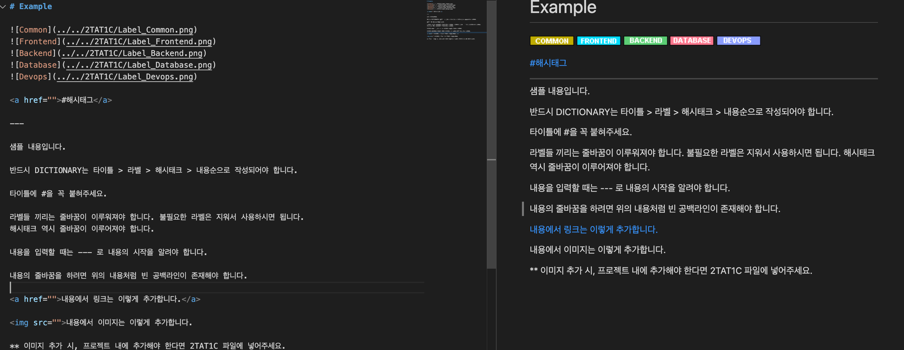

# DICTIONARY 문법

Dictionary는 마크다운 파일로 구성됩니다. 각각의 단어들은 DIC 디렉토리의 안 단어의 첫번째 알파벳 디렉토리에 위치합니다.

예시) Example.md
```
./DIC/E/Example.md
```

각각의 단어 파일은 **타이틀**, **라벨**, **해시태그**, **내용** 으로 이루어져 있습니다. 



## 순서

타이틀 > 라벨 > 해시태그 > 내용

각각의 단어들은 **반드시 위 순서대로 작성되어야 합니다**

그리고 구성 마다 **하나 이상의 공백으로 이루어진 줄이 반드시** 있어야 합니다.

## 타이틀

타이틀은 가장 위에 위치합니다.

타이틀 명 앞에는 항상 # 을 붙여서 `Heading level 1` 스타일을 만들어주세요.

## 라벨

라벨은 단어를 정해진 카테고리로 나누는 데 사용 됩니다.

라벨은 타이틀 다음에 위치합니다.

총 다섯개의 예약된 라벨이 있고 그것만 사용가능 합니다. (요청에 따라 이후 추가 개발이 될 수 있습니다.)

- Common : 일반적인 컴퓨터 과학용어일 떄 붙이는 라벨입니다.
- Frontend : 프론트엔드 (UI/UX) 등과 관련된 기술일 떄 붙이는 라벨입니다.
- Backend : 백엔드 (Server) 등과 관련된 기술일 때 붙이는 라벨입니다.
- Database: 데이터베이스와 관련된 기술일 때 붙이는 라벨입니다.
- Devops : CI/CD, 배포 등과 관련된 Devops 기술일 때 붙이는 라벨입니다. 

## 해시태그

해시태그는 단어와 관련된 기능, 혹은 추가로 공유하고 싶은 링크등 자유롭게 사용할 수 있는 구성입니다. 

해시태그는 라벨 다음에 위치합니다.

해시태그는 <a href="https://developer.mozilla.org/ko/docs/Web/HTML/Element/a">a태그</a>로 이루어져 있습니다.

해시태그는 이름 그대로 `#` 문자가 필수적입니다.

예시)
```
<a href="https://github.com/meotitda">#테스트</a>
```

## 내용

내용은 해시태그 다음에 위치합니다.

내용의 시작을 알리기 위해서는 **반드시 `---` 로 해시태그와 구분하셔야 합니다.**

그 이후 내용을 작성하실 수 있습니다.

줄바꿈을 하려는 경우에는 문장과 문장사이에 빈 공백으로 이루어진 라인이 하나 있어야 합니다.

이미지와 링크를 삽입하려는 경우 <a href="https://developer.mozilla.org/ko/docs/Learn/HTML/Introduction_to_HTML/Getting_started">html</a>문법을 이용하실 수 있습니다.