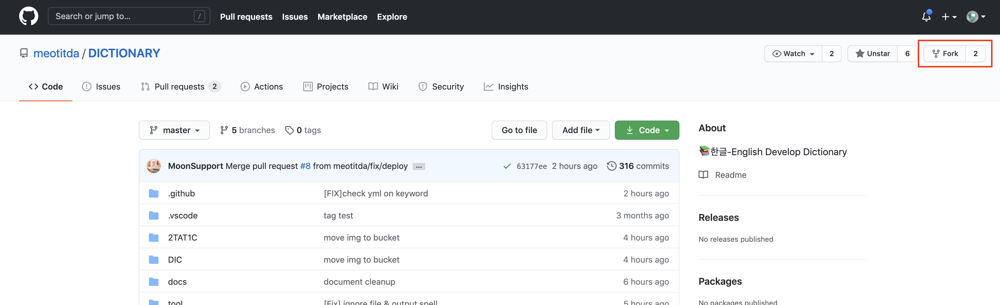
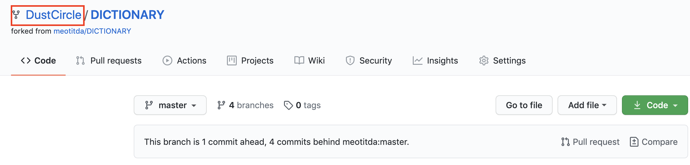
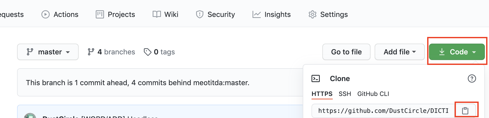
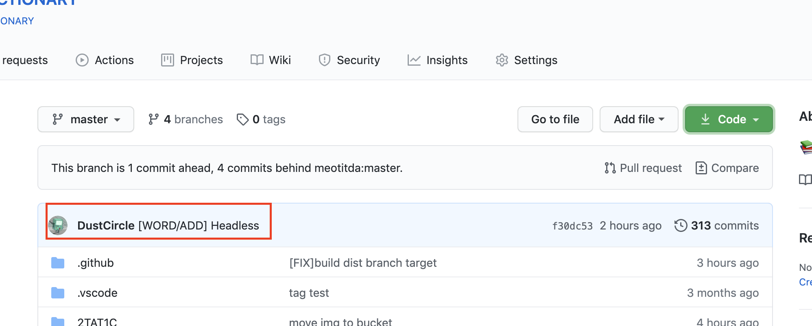
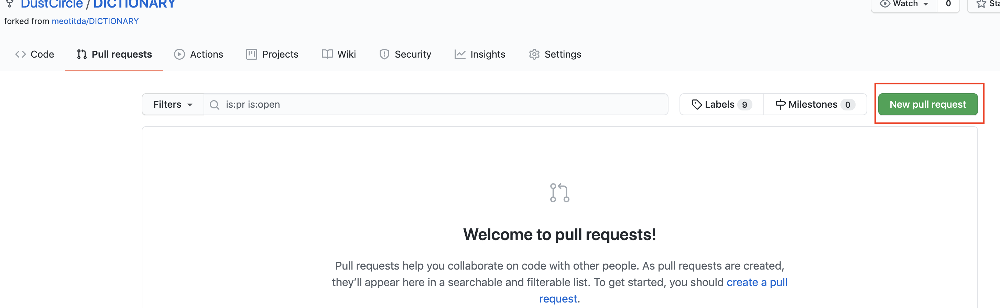
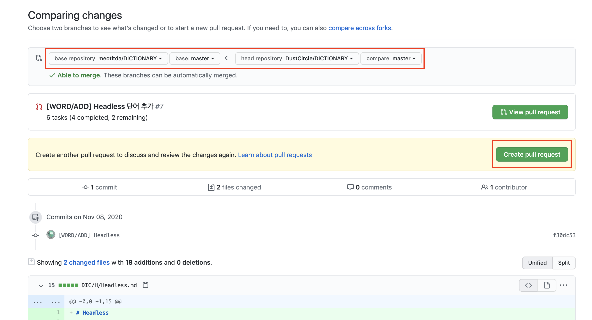
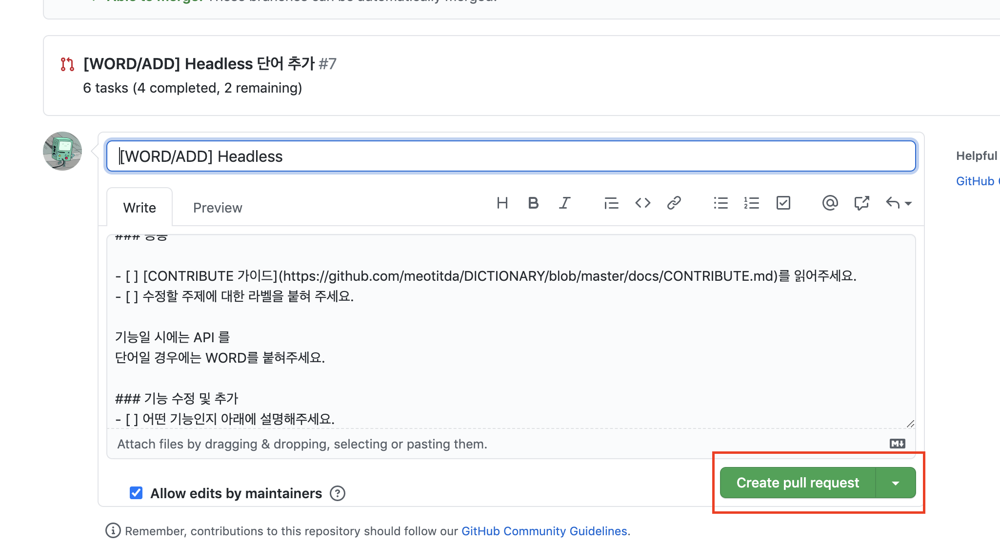
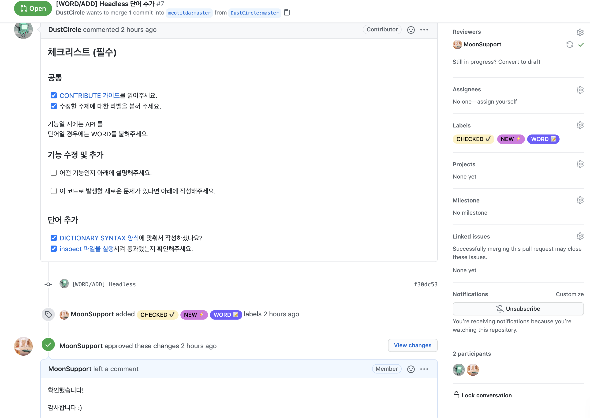

# Dictionary를 통한 GITHUB 사용법

## 목적

우리의 최종 목적은 작성한 단어를 DICTIONARY에 PULL_REQUEST로 요청하는 일입니다.
이를 학습하기 위해 [생활코딩](https://www.youtube.com/watch?v=uvsz2XgRPfM) 영상 혹은 [KennethanCeyer님의 github 튜토리얼](https://www.pigno.se/barn/tutorial-git/docs/#/)을 참고 할 수 있습니다. 

만약 원치 않으시다면 아래 리스트를 차례대로 수행 하셔도 좋습니다. 👍

## 선행되어야 할 것
1. GIT이 설치되어 있지 않다면 운영체제에 맞는 [git을 다운](https://git-scm.com/downloads)받는다.

2. 설치 후에 계정 정보를 입력한 적이 없다면 입력한다

```
git config --global user.name "Name명"
git config --global user.email "메일주소" 
```

## 작업 순서

1. fork를 한다.



2. 내 레파지토리를 클론 받는다.


> https 주소를 복사하고 다음 명령어를 터미널에서 실행시킨다.

```
git clone "복사한 주소(Ctrl+V)"
```

3. new 파일을 실행시킨다.

Window (.exe)
```
./run.exe [추가하려는 단어]
```

Mac Os, Linux (Shell)
```
sh new.sh [추가하려는 단어]
```

Node.js
``` 
node new.js [추가하려는 단어]
```

Python
``` 
python new.py [추가하려는 단어]
```

4. 단어를 수정 및 작성한다.

5. inspect 파일을 실행하여 이상이 없는 지 확인한다.

Node.js
``` 
node inspect.js
```

Python
``` 
python inspect.py
```

6. 다음 명령어를 차례대로 입력한다.

```
git add "파일명"
git commit -m "[ADD/WORD] 단어명"
git push origin master
```

7. 내 레파지토리에 수정이 반영된 것을 확인한다.


8. PR 양식에 맞춰서 요청한다.





9. 리뷰를 마치고 반영된다.

