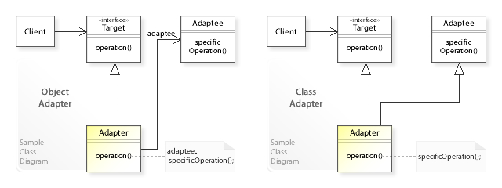

<content>

소프트웨어 엔지니어링에서 어댑터 패턴은 기존 클래스의 인터페이스를 다른 인터페이스로 사용할 수 있도록하는소프트웨어 디자인 패턴 (데코레이터 패턴과 공유되는 대체 이름인 래퍼라고도 함)입니다. 소스 클래스를 수정하지 않고 기존 클래스를 다른 클래스와 함께 작동시키는 데 종종 사용됩니다.

XML 문서의 문서 오브젝트 모델의 인터페이스를 표시 할 수있는 트리 구조로 변환하는 어댑터가 그 예입니다.

이 외에도 형식이 다른 인터페이스를 사용하기 위해 기능과 사용자 사이에서 연결 역할을 하는 기능을 Adapter라 부른다.

(<a href="https://en.wikipedia.org/wiki/Adapter_pattern">위키 백과</a>)

</content>
